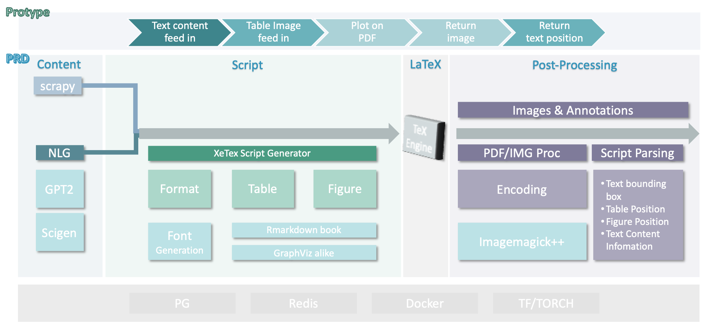
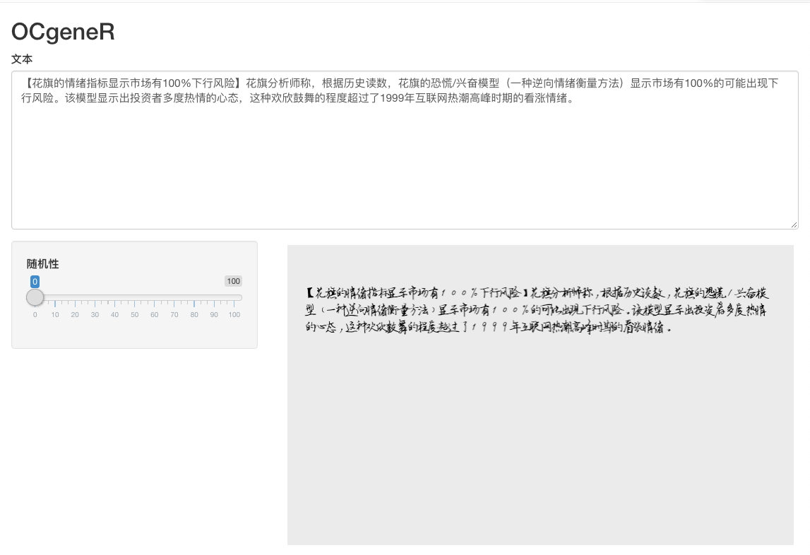
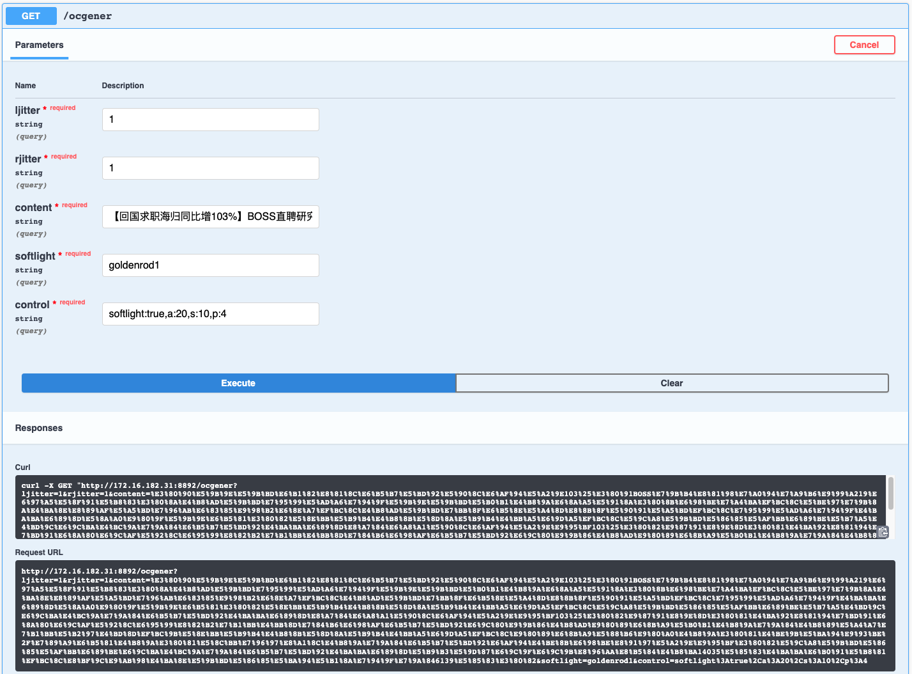
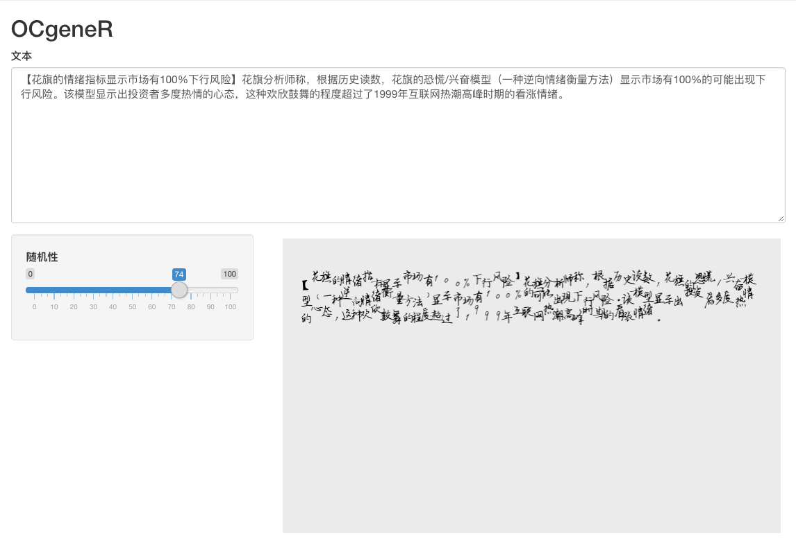
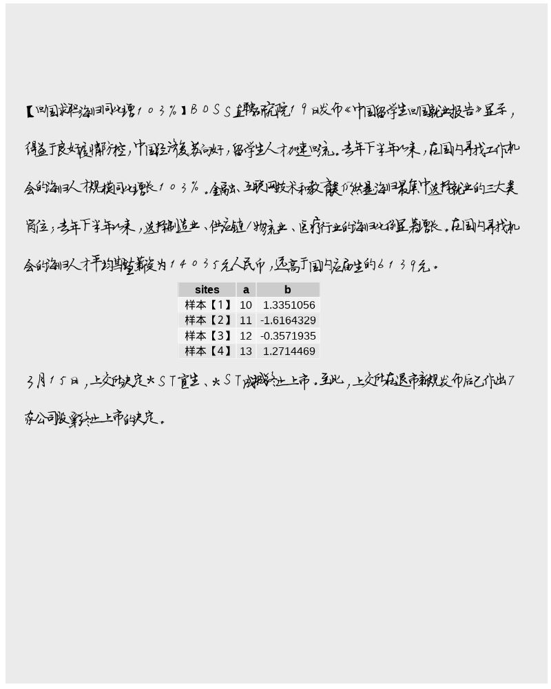

# ocgener
Image Generator for OCR

# Structure

## Phase I: protype

### Toolchain I

In this routine, we illusta the way of using R to finish the task.

- Input: 
    - text: 
    - tuning parameter list:
    - IM parameter list:
- Output:
    - Base64 coded Images in Jpeg (check the magick number for details)
    - Serilization of the boundingbox object. 

<detail>

- Text parsing: `stringi`, `fastjason`, `dplyr`, `RCurl` and regular regex

- Image Rendering: `ggplot2`, `ggextension`, `showtext` and ImageMagick++

- RESTFUL API: `Rcurl`, `plumber`
</detail>

The `plumber` package provides a simple UI for testing purpose, hence we don't to develop a client.

Note: 

- To make life easier, this routine includes a simple `shiny` server and user interface on the web side.

- Text generation is beyon our consideration in this stage. This function is provided through `Toolchain 2`, which provides an either English or Chinese version of `scigen`. 

- A simple random table generation schema is provided utilizing the `knitr`/`markdown` which render in a rather native manner.

- `font`, for Chinese font part, it is noticable that the Copyright issue is serious. Only `SourceHan` (lic details) is linked in this case. Indeed, one could generate one's own font. You may find [this](NULL) link useful.

#### Screenshots

Shiny Server

Restful API (with light tuning)

Shiny Server-Random line/row spaces

Mixture of text and tables (random generated demo, transparent background)

### Toolchain II

## Phase II: production
